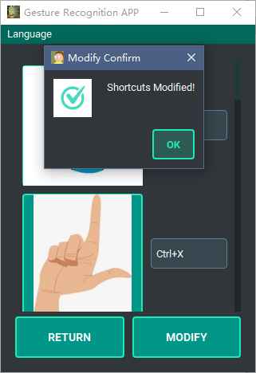
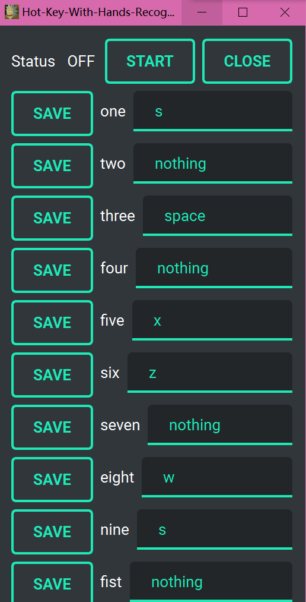

# Change Log

All notable changes to the "Hot-Key-With-Hands-Recognition" project will be documented in this file.

# 更新日志

本文件记录了 "Hot-Key-With-Hands-Recognition" 项目的所有重要更改。

## [0.2.0] - 2023-04-27

### Added

- Architecture upgrade, adopting layered design
- Added multi-language support, currently supporting Simplified Chinese, Traditional Chinese, and English
- Optimized the shortcut binding setting, from manual input to automatic capture of the pressed shortcut after clicking
- Optimized the shortcut binding interface, using pictures instead of text to display gestures
- Added an option to show or hide the camera
- UI interface optimization

### 新增

- 架构升级，采用分层设计
- 添加多语言支持，目前支持简体中文、繁体中文和英文
- 优化快捷键绑定设置，由手动输入改为点击后自动捕获按下的快捷键
- 优化快捷键绑定界面，使用图片代替文字显示手势
- 添加显示或隐藏摄像头的选项
- 用户界面优化

### [0.2.0] vs [0.1.0]

#### [0.2.0]

#### [0.1.0]

## [0.1.0] - 2022-12-25

### Added

- Initial version, implementing basic gesture recognition and shortcut binding functionality

## [0.1.0] - 2022-12-25 

### Added 

-  初始版本，实现基本的手势识别和快捷键绑定功能
