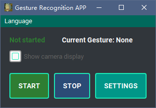
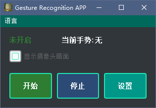
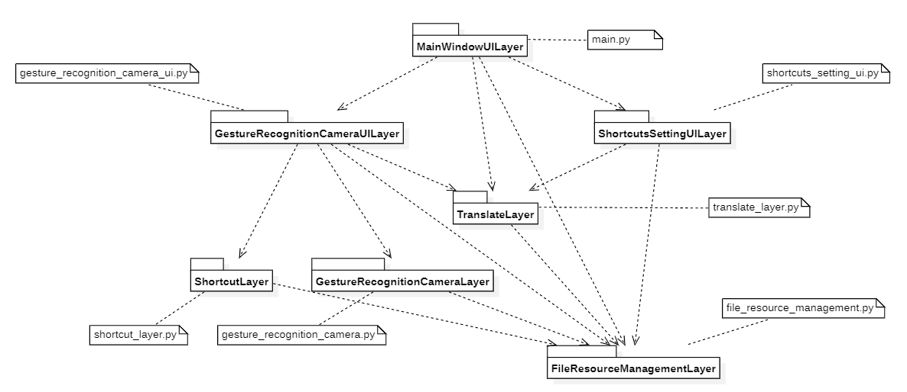

# 手势识别快捷键

[](https://opensource.org/licenses/MIT)[]()[]()

:globe_with_meridians: [English](README.md) |[中文](README-zh.md)

## 简介

这款基于手势识别的软件让您能够在不使用键盘或鼠标的情况下，轻松操作和浏览Windows计算机上的各种应用, 例如[在Tiktok隔空滑动刷视频](). 无论您是在干饭吃零食，还是离电脑稍远, 或者是单纯的想体验一把隔空控物, 都可以使用这款软件，享受无需触摸的便捷体验, 摄像头识别到的手势就会触发提前设置的的快捷键, 以此实现"隔空控物"的功能.

## 软件界面与使用方式

### 主界面:



### 选择语言:




### 设置手势对应的快捷键:


### 保存:


### 当前模型可能能识别出的手势


 

## 安装和运行

- 使用打包好的可执行文件运行

  进入releases,下载`gesture2shortcuts.exe`,点击即可运行

  注: 目前只打包好了Windows版本, Linux版本或Mac版本需要使用从源码构建的方式

- 从源码构建

  ```sh
  #下载并安装环境
  git clone https://github.com/LiRunJi/Hot-Key-With-Hands-Recognition.git
  cd Hot-Key-With-Hands-Recognition
  pip3 install -r requirements.py
  #运行APP
  python3 main.py
  ```

## 项目结构




## 参与贡献

很高兴看到您对此项目感兴趣并愿意为其贡献代码。可贡献的地方包括但不限于以下内容：

### 可贡献的内容

- 贡献手势识别模型

  在 saved_ai_model 或 saved_ai_lite_model 中提交更改

- 贡献手势训练脚本

  在 training 分支上提交更改

- 贡献软件架构和抽象

  在 abstract_layer.py 中提交更改

- 贡献用户界面

  在 assets/styles 中提交更改

- 贡献图标

  在 assets/gestures_icons 或任何其他地方提交更改

- 贡献翻译

  在 assets/translations.yml 中提交更改

  ```yaml
  supported_languages:
    - en
    - zh-CN
    - zh-TW
  #在此处添加新支持的语言，例如 -JP
  
  translations:
    Language:
      en: Language
      zh-CN: 语言
      zh-TW: 語言
  #然后翻译键并添加新键和值，例如 JP: 言語
  
    Start:
      en: Start
      zh-CN: 开始
      zh-TW: 開始
  
    Stop:
      en: Stop
      zh-CN: 停止
      zh-TW: 停止
  ```

- 贡献演示视频

  在 README_DEMO_VIDEOS.md 中提交更改

- 贡献其他内容

  在任何您喜欢的地方都可以提交更改

### 步骤

1. 在 GitHub 上 fork 该项目。
2. 克隆 fork 后的仓库到本地，可以使用以下命令：

```sh
git clone https://github.com/LiRunJi/Hot-Key-With-Hands-Recognition.git
```

3. 创建一个新的分支，并在该分支上进行开发，可以使用以下命令：

```sh
git checkout -b your_feature_branch
```

4. 在本地测试并确保代码质量。确保你的代码符合项目的质量标准，包括代码风格、变量命名规范、注释规范等，具体规范见下文。

5. 提交代码到 fork 后的仓库，可以使用以下命令：

```sh
git add .
git commit -m "Your commit message"
git push origin your_feature_branch
```

6. 在 GitHub上创建一个 Pull Request。在 Pull Request 中简要描述你所做的更改，并附上相应的截图或者示例。

### 规范

- 代码风格：建议使用 [PEP 8](https://www.python.org/dev/peps/pep-0008/) 作为代码风格指南。

- 变量及函数规范：尽量使用标准且通用的英语来命名变量, 最好是使用跟本仓库相似的命名风格.

- 提交信息规范：

  您可以参考以下格式:

  ```txt
  English Title / 中文标题
  
  The purpose of the commit and the changes made
  
  提交的目的和所做的更改
  
  Author: 作者名字
  
  Date: 提交日期
  ```

## [版本更新记录](CHANGELOG.md)

## 下一个版本的更新预告

未来有可能在某段时间通过以下方式进行更新

### 功能更新预告

- #### 智能家居与物联网

  目前识别发送出的信号仅限于触发相应的快捷键

  在这个软件发布前已经制作出了使用手势控制进行隔空开灯的草稿, 但那个草稿的软件结构几乎没有, 并且存在很多安全问题, 进一步的想法是搭建一个物联网系统, 并将其接入到该系统内.

### 界面更新预告

- #### 界面主题设置功能

  预计会在.qss文件内提供多套组件的UI方案, 可以选择相应的主题

- #### 更完备的设置功能

### 架构更新预告

- 提供更完备的分层与抽象

### 体积压缩预告

- 考虑使用C++或使用更轻量级的模型框架,以减少打包后的体积

## 鸣谢

[ChatGPT](https://chat.openai.com)

[Home | mediapipe (google.github.io)](https://google.github.io/mediapipe/)

[TensorFlow](https://tensorflow.google.cn/)

[PyCharm: the Python IDE for Professional Developers by JetBrains](https://www.jetbrains.com/pycharm/)

[GitHub - boppreh/keyboard: Hook and simulate global keyboard events on Windows and Linux.](https://github.com/boppreh/keyboard)

[PyQt5 · PyPI](https://pypi.org/project/PyQt5/)

[Qt-Material — Qt Material documentation](https://qt-material.readthedocs.io/en/latest/index.html)

[PyInstaller Manual — PyInstaller 5.6.2 documentation](https://pyinstaller.org/en/stable/)

[auto-py-to-exe · PyPI](https://pypi.org/project/auto-py-to-exe/)
