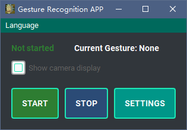
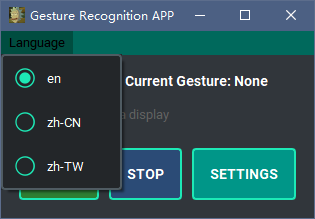
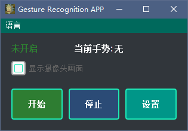
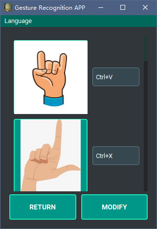
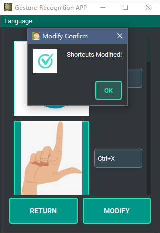
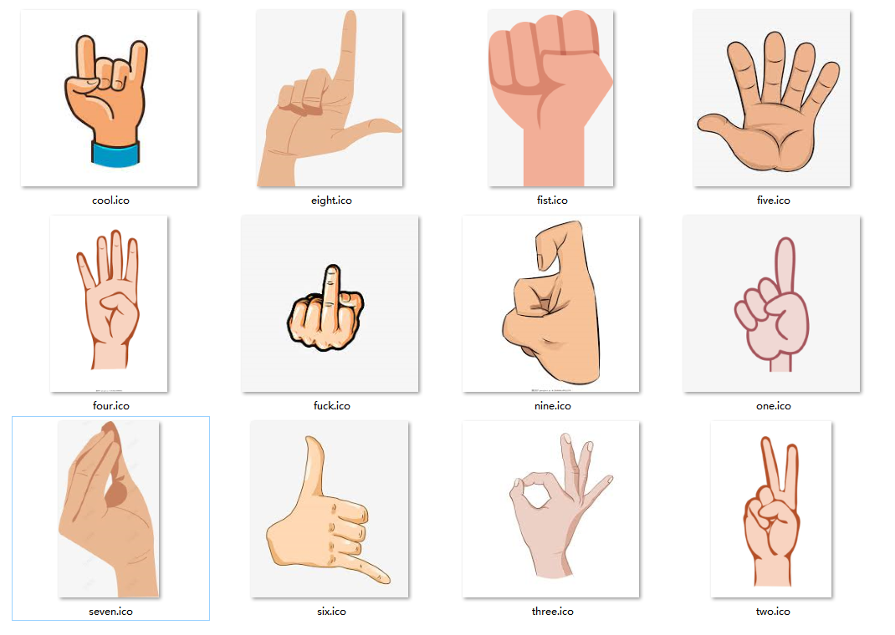
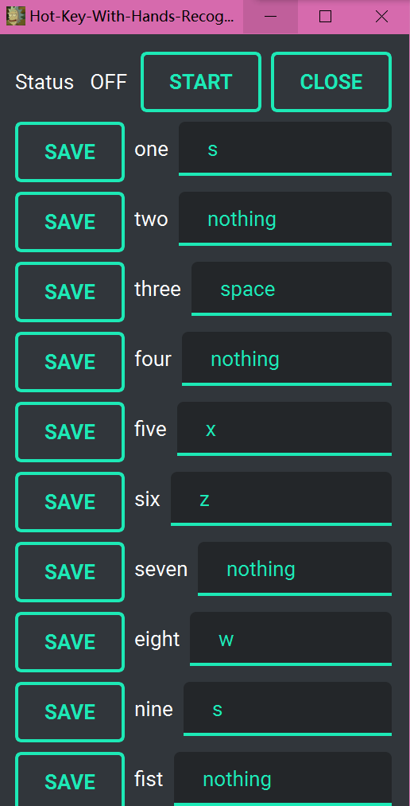
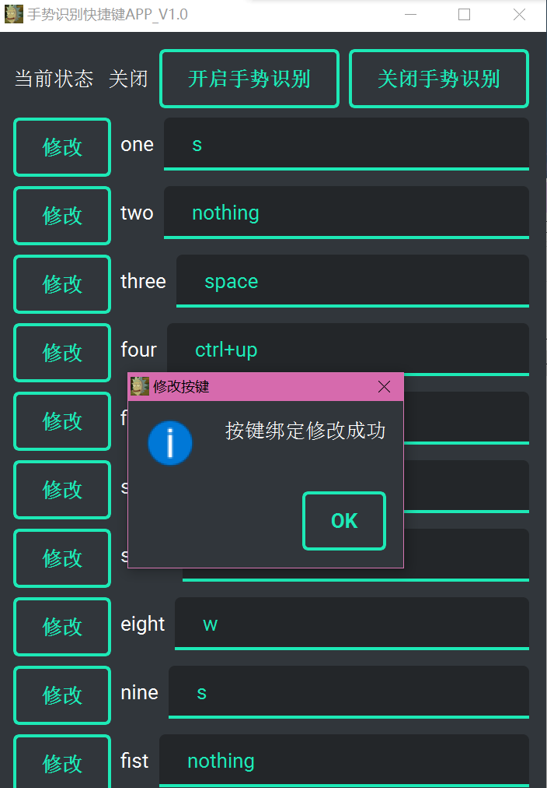

# Gesture Recognition Shortcuts

[](https://opensource.org/licenses/MIT) [](?model=text-davinci-002-render-sha) [](?model=text-davinci-002-render-sha)

:globe_with_meridians: **Supported Languages**: [English](README.md) |[中文](README-zh.md)

## Introduction

This is an application that binds shortcuts based on gesture recognition. It can trigger specific shortcuts based on the gestures recognized by the camera. This feature can achieve a touchless control effect, such as swiping on Douyin without touching the phone:

[You can click this link to see the demo of the program (this is an old version, a new version is being made)](https://www.youtube.com/watch?v=vOSos8CcdtQ)

You can download the pre-packaged `.exe` file in [releases](https://github.com/LiRunJi/Hot-Key-With-Hands-Recognition/releases), or run it through the source code.

You can also train your own gesture recognition model through the [training branch](https://github.com/LiRunJi/Hot-Key-With-Hands-Recognition/tree/training-zh) or build your own gesture recognition model by implementing the abstract interface.

## Software Interface and Usage

### Main Interface:




### Language Selection:





### Set the corresponding shortcut for the gesture:



### Save:



### Gestures that the current model may recognize



## Installation and Running

- Run using pre-packaged executable file

  Go to releases and download `gesture2shortcuts.exe`, and click to run.

  Note: Currently only the Windows version has been packaged, the Linux or Mac version needs to be built from the source code.

- Build from source code

  ```
  shCopy code# download and install environment
  git clone https://github.com/LiRunJi/Hot-Key-With-Hands-Recognition.git
  cd Hot-Key-With-Hands-Recognition
  pip3 install -r requirements.py
  # run the app
  python3 main.py
  ```

## Project Structure


## Contributing to the Code

We are very happy to see that you are interested in this repository and are willing to contribute code to it. We welcome contributions, including but not limited to the following:

### Contributable content

- Contributing gesture recognition models
- Contributing gesture training scripts
- Contributing software architecture and abstraction
- Contributing user interface
- Contributing icons
- Contributing translations
- Contributing demo videos
- Contributing other content

### Steps

1. Fork this project on GitHub.
2. Clone the forked repository locally using the following command:

```
git clone https://github.com/LiRunJi/Hot-Key-With-Hands-Recognition.git
```

1. Create a new branch and start developing on it. You can use the following command:

```
git checkout -b your_feature_branch
```

1. Test the changes locally and make sure the code quality is good. Ensure that your code meets the quality standards of the project, including coding style, variable naming conventions, and comment conventions, etc., as specified below.
2. Commit the changes to the forked repository using the following command:

```
git add .
git commit -m "Your commit message"
git push origin your_feature_branch
```

1. Create a pull request on GitHub. In the pull request, briefly describe the changes you made and provide relevant screenshots or examples.

### Standards

- Coding style: It is recommended to use [PEP 8](https://www.python.org/dev/peps/pep-0008/) as the coding style guide.

- Variable and function specifications: Use standard and common English to name variables as much as possible. It is best to use a naming style similar to that of this repository.

- Commit message specifications:

  You can refer to the following format:

  ```
  English Title / 中文标题
  
  The purpose of the commit and the changes made
  
  提交的目的和所做的更改
  
  Author: 作者名字
  
  Date: 提交日期
  ```

## Version History

### V0.2.0

- Architecture upgrade, adopting layered design

- Added multi-language support, currently supporting Simplified Chinese, Traditional Chinese, and English

  Due to the Qt's built-in translation requiring the download of too much content, which is more troublesome, a lightweight translation method that supports multiple languages is implemented separately here.

- Optimized the shortcut binding setting, from manual input to automatic capture of the pressed shortcut after clicking

- Optimized the shortcut binding interface, using pictures instead of text to display gestures

- Added an option to show or hide the camera

- UI interface optimization

  

  


### V0.1.0





## Next Version Preview

It is possible that the next update will be released at some point in the future through the following means.

### Function Update Preview

- #### Smart Home and IoT

  Currently, the recognition of the signals sent is limited to triggering the corresponding shortcuts.

  Before this software was released, a draft of using gestures to control lighting remotely was made, but the software structure of that draft was almost non-existent, and there were many security issues. Further ideas include building an IoT system and integrating it into this system.

### Interface Update Preview

- #### Interface Theme Setting Function

  It is expected to provide multiple sets of UI schemes in the .qss file, and you can choose the appropriate theme.

- #### More comprehensive setting function

### Architecture Update Preview

- Provide more comprehensive layering and abstraction.

### Volume Compression Preview

- Consider using C++ or a lighter model framework to reduce the size after packaging.

  

## Thanks to

[ChatGPT](https://chat.openai.com)

[Home | mediapipe (google.github.io)](https://google.github.io/mediapipe/)

[TensorFlow](https://tensorflow.google.cn/)

[PyCharm: the Python IDE for Professional Developers by JetBrains](https://www.jetbrains.com/pycharm/)

[GitHub - boppreh/keyboard: Hook and simulate global keyboard events on Windows and Linux.](https://github.com/boppreh/keyboard)

[PyQt5 · PyPI](https://pypi.org/project/PyQt5/)

[Qt-Material — Qt Material documentation](https://qt-material.readthedocs.io/en/latest/index.html)

[PyInstaller Manual — PyInstaller 5.6.2 documentation](https://pyinstaller.org/en/stable/)

[auto-py-to-exe · PyPI](https://pypi.org/project/auto-py-to-exe/)